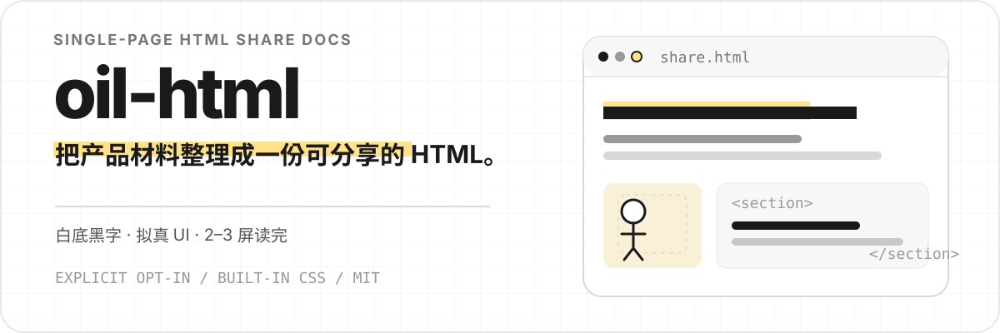

<p align="center">
  
</p>

<p align="center">
  一个只在明确点名时启用的 HTML 分享文档 Skill。
</p>

<p align="center">
  <code>Single-page HTML</code> · <code>Built-in design system</code> · <code>Explicit opt-in</code> · <code>MIT</code>
</p>

## 它可以完成什么

`oil-html` 用于制作面向读者的单页 HTML 文档，适合功能介绍、产品展示和方案说明。它把内容控制在 2–3 屏内，并用拟真 UI、步骤条和少量插画代替重复解释。

| 内容 | 结果 |
| --- | --- |
| 产品或功能材料 | 整理成 4–5 个以内的阅读模块 |
| 过程和操作 | 使用聊天、终端、平台卡片或步骤条展示 |
| 视觉系统 | 白底黑字、微弱网格和暖黄强调 |
| 交付文件 | 完整的单页 HTML，可直接打开和分享 |

## 适用范围

适合：

- 功能介绍
- Skill 演示
- 产品展示
- 方案说明

不适合：

- API 参考和内部技术文档
- 需要实时数据与表单提交的产品界面
- 16:9 翻页演示或 PowerPoint

## 安装

### Claude Code

```bash
git clone https://github.com/oil-oil/oil-html.git ~/.claude/skills/oil-html
```

### Codex

```bash
git clone https://github.com/oil-oil/oil-html.git ~/.codex/skills/oil-html
```

## 使用

这个 Skill 不会因为普通的 HTML 或落地页任务自动触发。请明确点名：

```text
使用 $oil-html，把这份产品材料整理成一份可分享的单页 HTML 文档。
```

也可以直接限定内容：

```text
使用 $oil-html，制作一份 3 屏以内的功能介绍，重点展示操作流程和最终结果。
```

## 设计约定

- 正文不小于 14px，默认使用 16px 和 1.85 行高。
- 一份文档控制在 2–3 屏、4–5 个模块以内。
- 黑、白、灰为主，暖黄作为常驻强调色。
- 能用拟真 UI 展示的内容，不再重复编写说明。
- 插画只解释抽象概念，不替代真实产品内容。
- 最终交付完整 HTML，样式直接内联。

## 仓库内容

```text
oil-html/
├── SKILL.md
├── oil-html.css
├── agents/
│   └── openai.yaml
└── assets/readme/
    └── hero.svg
```

`SKILL.md` 定义内容和制作规则，`oil-html.css` 提供页面、排版、卡片、聊天、平台、终端、步骤和插画容器等基础样式。

## License

[MIT](LICENSE)
