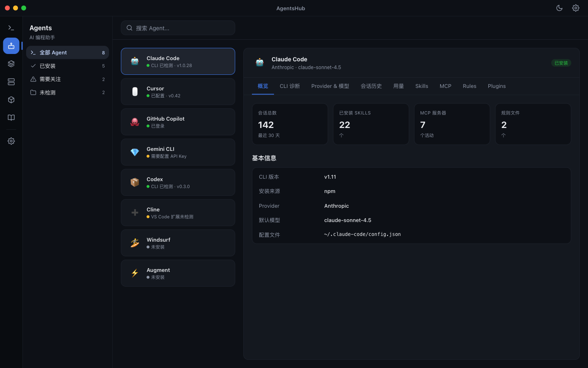
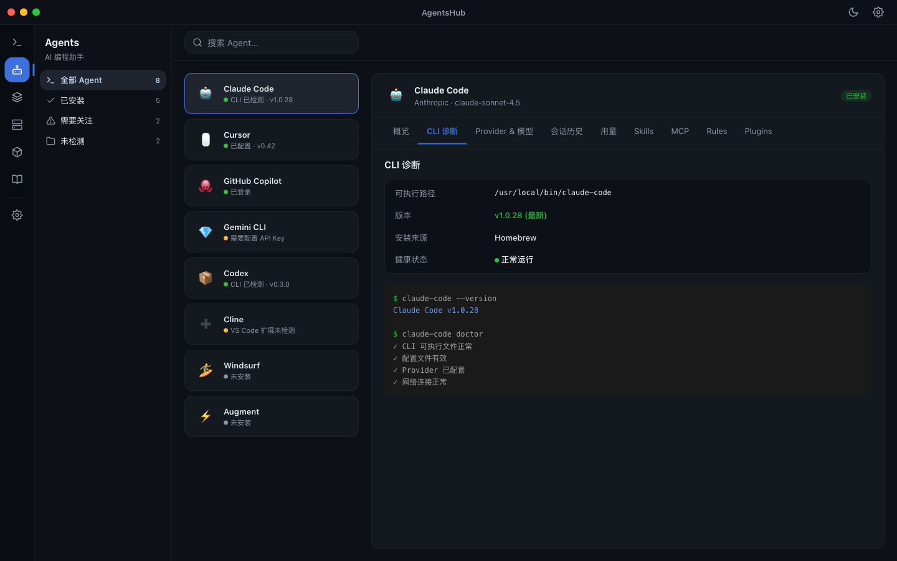
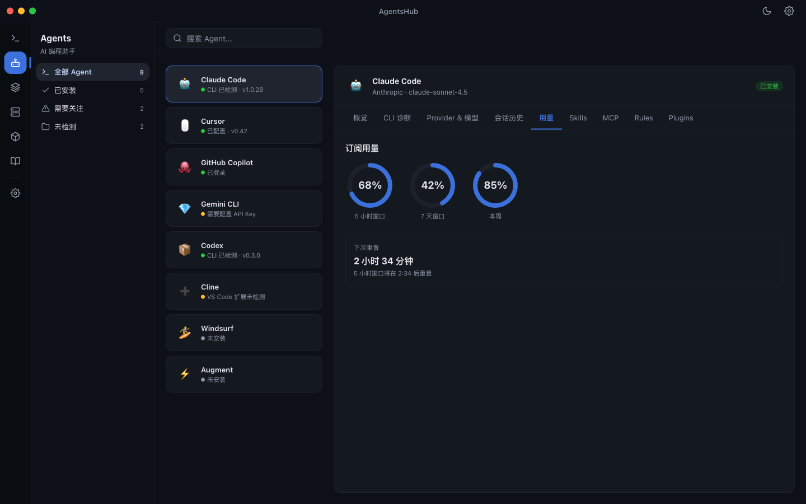
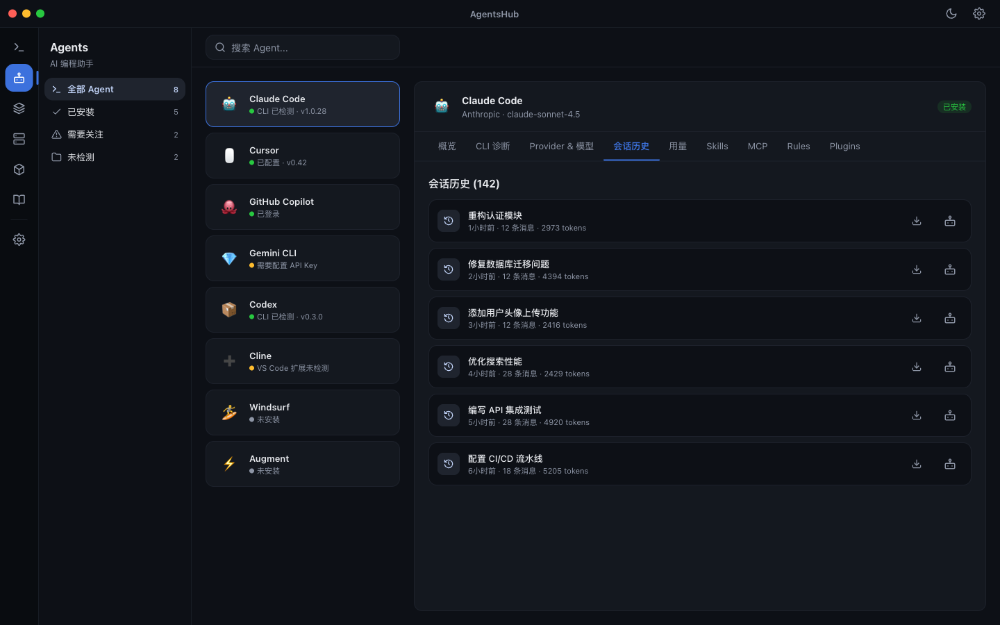
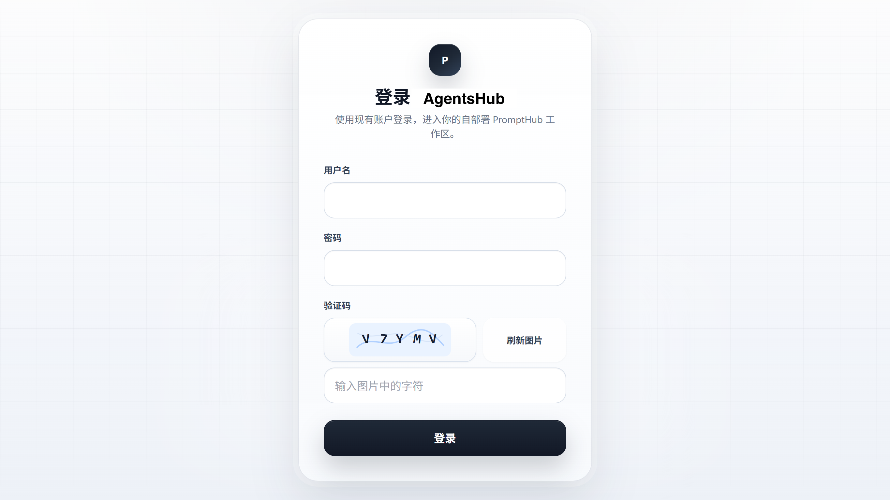

<div align="center">
  
</div>

<br/>

<div align="center">

# AgentsHub

本地优先的 Prompt、Skill 与 AI 编程资产工作台。

把你的 Prompt、SKILL.md 和项目级 AI 编程资产放进一个本地工作区：同一份 Skill 一键安装到 Claude Code、Cursor、Codex、Windsurf、Cline 等 15+ 工具；Prompt 支持版本管理与多模型对比测试；数据通过 WebDAV 同步到其他设备，或把完整快照备份到自部署 Web。

数据默认只存在你自己的电脑上。

<br/>

[](https://github.com/YZhuAndrew/AgentsHub/releases/latest)
[](./LICENSE)
[](https://github.com/YZhuAndrew/AgentsHub/releases)
[](https://github.com/YZhuAndrew/AgentsHub/releases)
[](https://github.com/YZhuAndrew/AgentsHub/releases)


[简体中文](./README.md) · [繁體中文](./docs/README.zh-TW.md) · [English](./docs/README.en.md) · [日本語](./docs/README.ja.md) · [Deutsch](./docs/README.de.md) · [Español](./docs/README.es.md) · [Français](./docs/README.fr.md)

<br/>

<a href="https://github.com/YZhuAndrew/AgentsHub/releases/latest">
  
</a>

</div>

---

## 目录

- [下载安装](#下载安装)
- [截图](#截图)
- [核心能力](#核心能力)
- [快速上手](#快速上手)
- [自部署网页版](#自部署网页版)
- [命令行 CLI](#命令行-cli)
- [从源码运行](#从源码运行)
- [仓库结构](#仓库结构)
- [更新日志](#更新日志)
- [路线图](#路线图)
- [贡献与文档](#贡献与文档)
- [许可证 / 反馈](#许可证--反馈)
- [赞助](#赞助)
- [致谢](#致谢)

---

## 下载安装

桌面版构建发布在 GitHub Releases，覆盖 macOS / Windows / Linux。

| 平台 | 安装包 |
| ---- | ------ |
| macOS（Apple Silicon） | [arm64 DMG](https://github.com/YZhuAndrew/AgentsHub/releases/latest) |
| macOS（Apple Silicon） | [zip 便携版](https://github.com/YZhuAndrew/AgentsHub/releases/latest) |
| Windows（x64） | [x64 Setup](https://github.com/YZhuAndrew/AgentsHub/releases/latest) |
| Linux | 前往 [Releases 页](https://github.com/YZhuAndrew/AgentsHub/releases) 查看可用构建 |

> **macOS 选哪个？** 仅提供 Apple Silicon（M1/M2/M3/M4）`arm64` 构建。便携版 zip 解压即用，无需安装。
> 历史版本与完整 Release Notes 见 [Releases 页](https://github.com/YZhuAndrew/AgentsHub/releases)。

### macOS 安全验证

AgentsHub 是社区维护的 fork 构建，未配置 Apple Developer 签名。请从 GitHub Release 下载；首次启动时 macOS Gatekeeper 可能拦截。

如果系统提示「已损坏」或「无法验证开发者」，可以在终端执行：

```bash
sudo xattr -rd com.apple.quarantine /Applications/AgentsHub.app
```

然后重新打开应用。如果应用安装在其他位置，把路径替换成实际安装路径。

<div align="center">
  
</div>

### 预览通道

如果你想体验下一版的开发预览版，可以在「设置 → 关于」打开「预览版通道」开关，应用会从 GitHub Prereleases 拉取构建。一旦关掉这个开关，更新会回到稳定版，并且不会从较新的预览版自动降级到较旧的稳定版。

---

## 截图

> 以下截图覆盖桌面端主要工作区：Prompt、Skill、Agent、MCP、Plugin 与 Rules。

<div align="center">
  <p><strong>主界面（双栏首页）</strong></p>
  
  <br/><br/>
  <p><strong>Skill 商店</strong></p>
  
  <br/><br/>
  <p><strong>Skill 详情与一键安装到 15+ 平台</strong></p>
  
  <br/><br/>
  <p><strong>Agent 工作区：统一管理多个 AI 编程助手</strong></p>
  
  <br/><br/>
  <p><strong>Agent CLI 诊断：检测已安装工具的版本与健康状态</strong></p>
  
  <br/><br/>
  <p><strong>Agent 用量监控：按时间窗口统计订阅消耗</strong></p>
  
  <br/><br/>
  <p><strong>Agent 会话历史：集中浏览、导出与移交各工具会话</strong></p>
  
  <br/><br/>
  <p><strong>MCP 工作区</strong></p>
  
  <br/><br/>
  <p><strong>Plugin 工作区</strong></p>
  
  <br/><br/>
  <p><strong>Rules 工作区</strong></p>
  
  <br/><br/>
  <p><strong>项目级 Skill 工作区</strong></p>
  
  <br/><br/>
  <p><strong>Quick Add 多入口（手动 / 分析 / AI 生成）</strong></p>
  
  <br/><br/>
  <p><strong>外观与动画偏好</strong></p>
  
</div>

---

## 核心能力

### 📝 Prompt 管理

- 文件夹、标签、收藏三层组织，可拖拽排序，CRUD 全覆盖
- 模板变量 `{{variable}}`，复制 / 测试 / 分发时弹表单填值
- 全文搜索（FTS5），Markdown 渲染与代码高亮，附件 / 多媒体预览
- 桌面卡片支持双击进入 inline 编辑用户 Prompt 和 System Prompt

### 🧩 Skill 商店与一键分发

- **技能商店**：内置 20+ 精选技能（来自 Anthropic、OpenAI 等），可叠加自定义商店源（GitHub / skills.sh / 本地目录）
- **一键安装到平台**：Claude Code、Cursor、Windsurf、Codex、Antigravity、Kiro、Kilo Code、Cline、Qoder、QoderWork、CodeBuddy、Trae、Trae CN、OpenCode 等 15+ 平台
- **本地扫描**：自动发现本地已有 SKILL.md，预览选择后导入，避免在多个工具目录间复制粘贴
- **Symlink / Copy 双模式**：选 symlink 共享编辑，选 copy 各平台保留独立副本
- **平台目标目录可覆写**：为每个平台单独配置 Skills 目录，扫描和分发保持一致
- **AI 翻译与润色**：以完整 SKILL.md 为单位生成 sidecar 译文，支持沉浸式对照和全文翻译
- **安全策略**：安装/更新前的内容与 AI 扫描可按全局、来源渠道和具体商店精细开关；关闭扫描仍强制执行路径、压缩包、符号链接、体积、必需文件和指纹校验
- **GitHub Token**：商店与仓库导入支持鉴权，减少匿名限流失败
- **标签筛选**：按标签快速过滤已安装与商店技能

### 📐 Rules（AI 编程规则）

- 集中管理 `.cursor/rules`、`.claude/CLAUDE.md`、AGENTS.md 等规则文件
- 支持手动添加项目级 Rules，按目录分组浏览
- 与 ZIP 导出、WebDAV、自托管备份恢复、Web 导入导出全链路打通

### 🤖 Agent 工作区：多 AI 编程助手的统一指挥台

- 在一个界面管理 Claude Code、Cursor、Copilot、Gemini、Codex、Cline、Windsurf、Augment 等多个 AI 编程工具
- **CLI 诊断**：自动检测每个工具的安装状态、CLI 版本与配置健康度，问题一目了然
- **用量监控**：按 5 小时 / 7 天 / 本周等时间窗口统计订阅消耗，把握额度节奏
- **会话历史**：集中浏览各工具的会话，支持导出与跨工具移交，不用在多个终端和窗口间翻找
- 扫描项目里的 `.claude/skills`、`.agents/skills`、`skills`、`.gemini` 等目录，为单个项目建立独立 Skill 工作区，不污染全局库
- 个人库、本地仓库、项目资产同一界面切换；全局 Prompt 标签可集中搜索、重命名、合并、删除，数据库与工作区文件一并同步

### 🧪 AI 测试与生成

- 内置 AI 测试，主流国内外服务商都能配（OpenAI、Anthropic、Gemini、Azure、自定义 endpoint 等）
- 同一 Prompt 多模型并行对比，文本和图像模型都支持
- AI 生成技能、AI 润色技能、Quick Add AI 直接生成结构化 Prompt 草稿
- 统一的端点管理与连接测试，错误信息精确到 504 / 超时 / 未配置

### 🕒 版本控制与历史

- 每次保存 Prompt 自动写入历史版本，支持版本对比、差异高亮、一键回滚
- Skill 同样维护版本历史，可创建命名版本、查看差异、按版本回滚
- Rules 历史快照可预览、恢复到草稿
- 商店 Skill 安装时记录内容哈希，远端 SKILL.md 变更可检测，本地修改有冲突保护

### 💾 数据、同步与备份

- 本地优先：所有数据默认存在你自己的电脑上
- 全量备份 / 恢复使用 `.phub.gz` 压缩格式（沿用自上游的备份格式）
- WebDAV 同步（坚果云、Nextcloud 等），只允许一个活动同步源，避免多源冲突写入
- 自部署 AgentsHub Web 独立保存不可变快照；启动和定时任务只上传，绝不会自动拉取或覆盖本地数据
- 桌面版与 Web 版必须完全同版本才会备份；恢复由用户显式触发，并先创建本地安全快照

### 🔐 隐私与安全

- 主密码保护应用入口，AES-256-GCM 加密；私密文件夹内容加密存储（Beta）
- 跨平台离线运行：macOS / Windows / Linux
- 7 种界面语言：简体中文、繁體中文、English、日本語、Deutsch、Español、Français

---

## 快速上手

1. **新建第一个 Prompt**：点「+ 新建」，写标题、描述、System Prompt 和 User Prompt。`{{变量名}}` 会变成一个变量，复制或测试时会弹表单让你填。

2. **把 Skills 纳入工作区**：去「Skills」标签，从商店选几个，或点「扫描本地」让 AgentsHub 自动找你电脑上已有的 SKILL.md。

3. **一键安装到 AI 工具**：在 Skill 详情页选目标平台。AgentsHub 会按平台规范把 SKILL.md 安装到对应目录。可以选 symlink（同步编辑）或独立复制。

4. **配置同步或备份（可选）**：「设置 → 数据」里配 WebDAV / S3 在线同步，或自部署一份 AgentsHub Web 保存独立恢复快照。

---

## 自部署网页版

AgentsHub Web 是一个轻量的浏览器版工作区，你可以用 Docker 把它跑在 NAS、VPS 或局域网里。它**不是**官方云服务，主要用途是：

- 在浏览器里访问自己的 AgentsHub 数据
- 给桌面版保存不改变在线工作区的不可变备份快照
- 不想让数据出本地局域网

```bash
cd apps/web
cp .env.example .env
docker compose up -d --build
```

`.env` 里有几个必须改的：

- `JWT_SECRET`：≥ 32 位随机字符串
- `ALLOW_REGISTRATION=false`：建议保持关闭，第一个用户初始化完之后就不要再开公开注册
- `DATA_ROOT`：数据根目录，会在下面创建 `data/`、`config/`、`logs/`、`backups/`

默认在 `http://localhost:3871`。第一次打开会跳到 `/setup`，你创建的第一个用户就是管理员。

桌面版接入这一份 Web：「设置 → 数据 → Self-Hosted AgentsHub」，填 URL、用户名、密码。可以测试版本与备份能力、创建远端快照、显式恢复最近快照，以及启用只上传的启动/定时自动备份。自动任务不会拉取、合并或覆盖本地数据。

### Cloudflare Workers 版（分支实验）

如果你希望把在线自部署版跑在 Cloudflare 边缘网络上，可以使用本仓库的 `apps/web-cloudflare`。它把 API 运行在 Workers，账号和旧同步快照元数据存到 D1，图片 / 视频媒体存到 R2。当前该分支仍实现旧 live-sync API；新版桌面端的备份专用 `/api/backups/desktop` 路由补齐前，不会把它当作安全自部署备份端点。

<div align="center">
  
  <p><strong>Cloudflare Workers 在线自部署登录页</strong></p>
</div>

当前 Cloudflare 版优先覆盖数据同步、Prompt / Folder / Rules / Skills 数据展示与媒体同步。安装到 Claude / Codex 本地目录、扫描本机技能仓库这类本地文件系统能力仍由桌面端负责。

更详细的 Docker / NAS / VPS 自部署说明在 [`docs/web-self-hosted.md`](./docs/web-self-hosted.md)，Cloudflare Workers + D1 + R2 部署说明在 [`docs/cloudflare-workers.md`](./docs/cloudflare-workers.md)。

---

## 命令行 CLI

AgentsHub 还附带一个命令行工具，适合脚本化管理、批量导入导出与自动化扫描。它需要从仓库自行打包安装。

<details>
<summary>安装步骤与命令一览（展开查看）</summary>

```bash
pnpm pack:cli
pnpm add -g ./apps/cli/prompthub-cli-*.tgz
prompthub --help
```

也可以不安装直接跑：

```bash
pnpm --filter @prompthub/cli dev -- prompt list
pnpm --filter @prompthub/cli dev -- skill scan
```

每个命令都有 `--help`：

```text
prompt    list / get / create / update / delete / duplicate / search
          versions / create-version / delete-version / diff / rollback
          use / copy
          list-tags / rename-tag / delete-tag
          relation list|create|update|delete
          output-format list|create|delete|reorder
          （create/update 支持 --parent-id 树父节点）

folder    list / get / create / update / delete / reorder

agent     list / get / enable / disable
          add / update / configure / reset / delete
          config list|read（只读检查并脱敏敏感值）
          identity get|set

rules     list / scan / read / save / rewrite
          versions / version-read / version-restore / version-delete
          add-project / remove-project
          export / import

skill     list / get / import（兼容别名：install）/ delete / remove
          versions / create-version / rollback / delete-version
          export / scan / scan-safety / sync-from-repo
          update / check-update
          platforms / platform-status / distribute / undistribute
          （兼容别名：install-md / uninstall-md）
          project-install / install-project
          repo-files / repo-read / repo-write / repo-delete / repo-mkdir / repo-rename

mcp       list / get / create / update / delete
          market / sources / install / import
          enable / disable / check / env-import
          export / apply / remove

plugin    list / get / market / sources / install / delete
          versions / create-version

ai        providers / provider-add / provider-delete
          models / model-add / model-delete
          routes / route-set / route-clear

workspace export / import
          （完整 SyncSnapshot：prompts、relations、output-formats、
           skills + skillFiles、MCP、plugins、rules、媒体）

sync      status / push / pull

doctor    database-lock [--recover]
```

Skill 导入、版本快照和分发统一应用内置忽略规则与根目录 `.prompthubignore`，并在写入前阻止疑似私钥、访问令牌和密码。默认成功输出是有界摘要；只有明确使用 `--full` 才返回 Skill 正文与完整文件快照。

常用全局参数：

- `--output json|table` — 输出格式
- `--summary` — 返回有界摘要（默认）
- `--full` — 返回完整资源内容
- `--quiet` — 成功时不输出 stdout，错误仍输出 stderr
- `--data-dir <path>` — 显式指定 AgentsHub 的 `userData` 目录
- `--app-data-dir <path>` — 显式指定应用数据根目录
- `--version|-v` — 打印 CLI 版本

</details>

> 注：CLI 二进制名 `prompthub`、包名 `@prompthub/*` 与备份格式 `.phub.gz` 沿用自上游，暂未重命名，不影响功能。

---

## 从源码运行

需要 Node.js ≥ 24、pnpm 9。

```bash
git clone https://github.com/YZhuAndrew/AgentsHub.git
cd AgentsHub
pnpm install

# 桌面端开发
pnpm electron:dev

# 桌面端构建
pnpm build

# 自部署 Web 构建
pnpm build:web
```

`pnpm build` 默认只构建桌面版。Web 需要显式 `pnpm build:web`。

常用开发命令：

| 命令                                             | 用途                                  |
| ------------------------------------------------ | ------------------------------------- |
| `pnpm electron:dev`                              | 启动桌面端开发环境（vite + electron） |
| `pnpm dev:web`                                   | 启动 Web 开发环境                     |
| `pnpm lint` / `pnpm lint:web`                    | 代码风格检查                          |
| `pnpm typecheck` / `pnpm typecheck:web`          | TypeScript 类型检查                   |
| `pnpm test -- --run`                             | 桌面端 vitest 单元 + 集成测试         |
| `pnpm test:e2e`                                  | Playwright e2e                        |
| `pnpm verify:web`                                | Web lint + typecheck + test + build   |
| `pnpm test:release`                              | 桌面端发布前完整门禁                  |
| `pnpm --filter @prompthub/desktop bundle:budget` | 桌面端 bundle 体积预算检查            |

---

## 仓库结构

```text
AgentsHub/
├── apps/
│   ├── desktop/   # Electron 桌面端
│   ├── cli/       # 独立 CLI（基于 packages/core）
│   └── web/       # 自部署 Web
├── packages/
│   ├── core/      # CLI 与桌面共享的核心逻辑
│   ├── db/        # 共享数据层（SQLite schema、查询）
│   └── shared/    # 共享类型、IPC 常量、协议定义
├── docs/          # 对外文档
├── spec/          # 内部 SSD / 设计规范
├── website/       # 官网相关资源
├── README.md
├── CONTRIBUTING.md
└── package.json
```

---

## 更新日志

完整版本说明见 **[CHANGELOG.md](./CHANGELOG.md)**。

### v0.8.1（2026-08-15，正式版）

- 修复 0.8.0 性能回退：canonical 工作区 reconcile 不再在每次数据库初始化时无条件重建全部技能工作区，启动恢复秒级可用，进入 Skills 页不再卡死
- 修复 0.8.0 回归：导入技能包含包内相对符号链接（如 `AGENTS.md -> CLAUDE.md` 别名）不再锁死启动；受控链接在快照/投影中物化或按相对目标重建，逃逸链接保持拒绝

### v0.8.0（2026-08-14，正式版）

- MCP 项目配置与 Pi 兼容目标：My MCP 合并全局/项目目标投影，环境变量与 Header 支持直填和引用两种取值，附引用健康警告与明文脱敏保护（#200 / #201 / #202）
- Agent 工作台收口：统一 Provider/模型工作台；PromptHub 供应商一键导入 Pi 原生 `models.json`/`auth.json`；Pi 模型目录编辑与配额感知测试；额度弹窗（含 Kimi 续费）与会话分页打磨
- 扩展已验证目标：Pi 兼容 MCP 发现、项目级 Cursor/Qoder 规则、OpenClaw/Qoder/Grok/Antigravity/Reasonix MCP 投影
- 生图工作台重塑：单作品审阅、固定设置与历史面板、显式参考图选择
- 文件优先本地数据权威；Prompt 列表按需加载（性能优化）
- 桌面体验：窗口大小/位置/最大化状态持久化；技能 Markdown 文件格式化预览；macOS 未签名直装更新改为引导手动下载 DMG

### v0.7.2（2026-08-13，正式版）

- 常驻状态栏图标：设置新增「常驻状态栏图标」开关（默认关闭），开启后启动即创建菜单栏/托盘图标，窗口打开时也常驻可见；可与最小化到托盘叠加，开关即时生效

### v0.7.1（2026-08-13，正式版）

- 升级备份修复：修复升级前数据备份遇到符号链接（如 symlink 模式安装的 skill 文件）直接报错、阻塞整个升级的问题；现在保留指向用户数据内部的符号链接、跳过指向外部的，并正确处理 macOS /var 路径归一化

### v0.7.0（2026-08-13，正式版）

- 技能批量导入：新增「批量导入」模式，可拖入/选择多个本地 ZIP 压缩包或粘贴多个 GitHub/Git 仓库 URL 一次性安装；本地 ZIP 走与远程包相同的原子安装管线；把 ZIP 拖到 My Skills 视图即可触发批量导入
- 平台可见性统一：Skills 分发/Agent 列表改为以设置「平台开关」为唯一判定，磁盘检测降级为提示，补齐 copilot/amp 排序；新增 QwenWork CN 平台；修正 trae-work-cn 默认根目录为 ~/.trae-cn

### v0.6.2（2026-08-11，正式版）

- 技能列表视图增强：列表视图改为默认展示，新增列头表格布局（名称+描述 / 来源 / 作者 / 版本 / 创建时间 / 更新时间 / 平台状态 / 操作）、作者筛选和"检查全部更新"批量操作，支持对所选技能批量更新
- Git 仓库导入进度：从 Git 仓库安装技能时，扫描与导入两阶段都展示详细进度（阶段标签、`index/total` + 技能名、实时克隆百分比），取代原来长时间无反馈的单一 spinner

### v0.6.1（2026-08-10，正式版）

- 新增千问办公（QwenWork）内置 Agent 平台目标，可直接向其分发 Skill
- 启动行为设置：应用启动后默认打开主界面、新增"启动界面"选择（默认恢复上次界面）、开机自启动

### v0.6.0（2026-08-09，正式版）

- AgentsHub 首个 fork 基线版本，统一 Desktop、CLI、自部署 Web、Cloudflare Worker 与 Mobile 的构建版本

### v0.5.9（2026-07-14，正式版）

- Plugin 管理正式收口：My Plugins / Plugin Store / Agent Plugin 对齐 Skill 风格，支持安装、详情、版本快照、来源更新确认、批量操作、Agent 分发和子 Skill / MCP 导入
- MCP 管理与同步能力扩展：MCP 工作台、官方模板商店、Agent 目标分发、健康检查、.env 按需导入、CLI MCP 命令和一键重同步阶段性收口
- 整套 Agent 资产备份：自托管备份恢复纳入 My Skills、My MCP、My Plugins 和 Rules 等数据
- Skill 来源更新改为 SHA-256 包指纹和三方对账，修复 registry 指纹、content-url 基线和 URL 脱敏问题
- Plugin 来源更新和批量商店更新先展示差异并要求确认，不再直接覆盖本地 Plugin
- Prompt 支持组合、排序和持久化自定义输出格式序列，并随备份恢复
- macOS 发布链路明确未签名 fork 的安装说明、DMG/ZIP 校验和 Gatekeeper 处理

更早版本更新内容见 [CHANGELOG.md](./CHANGELOG.md)。

---

## 路线图

- [ ] 浏览器扩展：在 ChatGPT / Claude 网页里直接调用 AgentsHub 库
- [ ] 移动端：手机查看、搜索、轻量编辑同步
- [ ] 插件机制：本地模型（Ollama 等）和自定义 AI 供应商
- [ ] Prompt 商店：复用社区验证过的提示词模板
- [ ] 更复杂的变量类型：选择框、动态日期等
- [ ] 用户上传分享自创 Skill

历史版本路线图见 [CHANGELOG.md](./CHANGELOG.md) 与版本发布说明。

---

## 贡献与文档

- 入口：[CONTRIBUTING.md](./CONTRIBUTING.md)
- 完整指南：[`docs/contributing.md`](./docs/contributing.md)
- 对外文档索引：[`docs/README.md`](./docs/README.md)
- 内部 SSD / spec：[`spec/README.md`](./spec/README.md)
- 项目内置 spec skill：[`spec-init`](./.agents/skills/spec-init/SKILL.md)
- 文档拓扑路由：[`spec-init.topology.yml`](./spec-init.topology.yml)

---

## 许可证 / 反馈

[AGPL-3.0](./LICENSE)

- 问题反馈：[GitHub Issues](https://github.com/YZhuAndrew/AgentsHub/issues/new)
- 联系维护者：yzhu.andrew@163.com

---

## 赞助

如果 AgentsHub 对你有帮助，欢迎请维护者喝杯咖啡 ☕

<div align="center">
  <table>
    <tr>
      <td align="center">
        
        <br/>
        <b>微信支付</b>
      </td>
      <td align="center">
        
        <br/>
        <b>支付宝</b>
      </td>
    </tr>
  </table>
</div>

---

## 致谢

AgentsHub fork 自 [PromptHub](https://github.com/legeling/PromptHub)（AGPL-3.0），感谢原作者 [legeling](https://github.com/legeling) 的开源贡献。本项目在其基础上扩展了 Agent 资产管理、CLI 诊断、用量监控等能力。

---

<div align="center">
  <p>如果 AgentsHub 对你有帮助，请给个 ⭐ 支持一下。</p>
</div>
