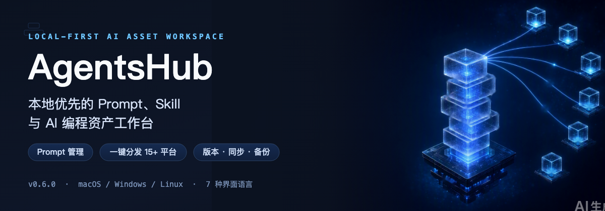
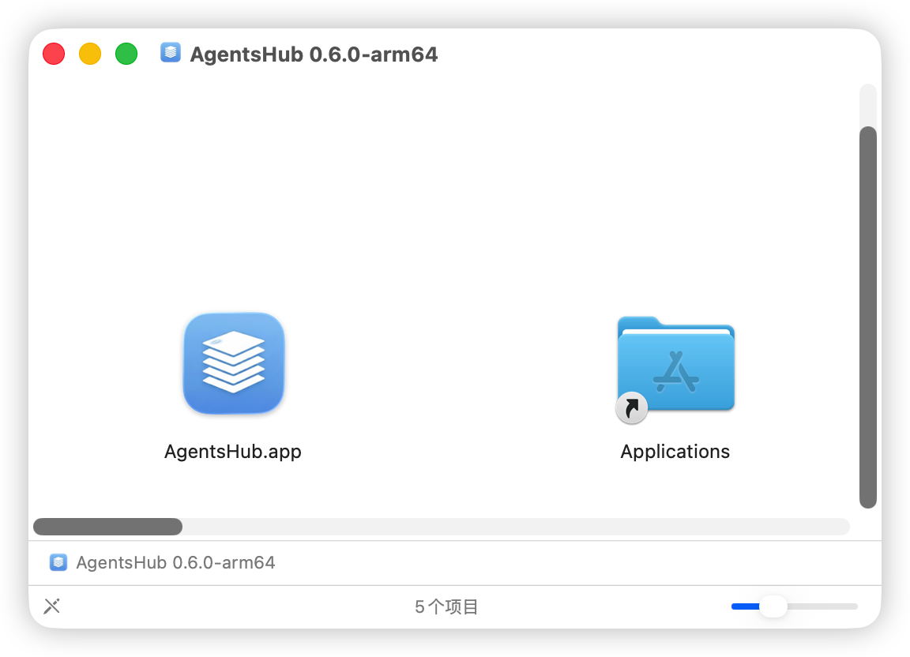

<div align="center">
  

# AgentsHub

プロンプト・Skill・AI コーディング資産のためのローカルファースト ワークスペース。

  <br/>

[](https://github.com/YZhuAndrew/AgentsHub/stargazers)
[](https://github.com/YZhuAndrew/AgentsHub/releases)
[](https://github.com/YZhuAndrew/AgentsHub/releases/latest)
[](../LICENSE)

  <br/>


  <br/>


  <br/>

[简体中文](../README.md) · [繁體中文](./README.zh-TW.md) · [English](./README.en.md) · [日本語](./README.ja.md) · [Deutsch](./README.de.md) · [Español](./README.es.md) · [Français](./README.fr.md)

  <br/>

  <a href="https://github.com/YZhuAndrew/AgentsHub/releases/latest">
    
  </a>
</div>

<br/>

AgentsHub はあなたのプロンプト、SKILL.md、プロジェクトレベルの AI コーディング資産を 1 つのローカルワークスペースにまとめます。同じ Skill を Claude Code、Cursor、Codex、Windsurf、Antigravity など十数のツールへワンクリックでインストールでき、プロンプトのバージョン履歴とマルチモデルテスト、WebDAV による別端末への同期、セルフホスト Web への完全スナップショット保存を備えています。

データは既定であなたのマシンに置かれます。

---

## 目次

- [デスクトップ版ダウンロード](#install)
- [スクリーンショット](#screenshots)
- [機能](#features)
- [はじめに](#quick-start)
- [セルフホスト Web](#self-hosted-web)
- [CLI](#cli)
- [変更履歴](#changelog)
- [ロードマップ](#roadmap)
- [ソースから実行](#dev)
- [リポジトリ構成](#project-structure)
- [貢献とドキュメント](#contributing)
- [ライセンス / フィードバック](#meta)

---

<div id="install"></div>

## 📥 デスクトップ版ダウンロード

デスクトップ版ビルドは GitHub Releases で macOS / Windows / Linux 向けに公開されています。

| プラットフォーム | インストールパッケージ |
| ---- | ------ |
| macOS（Apple Silicon） | [arm64 DMG](https://github.com/YZhuAndrew/AgentsHub/releases/latest) |
| macOS（Apple Silicon） | [zip ポータブル版](https://github.com/YZhuAndrew/AgentsHub/releases/latest) |
| Windows（x64） | [x64 Setup](https://github.com/YZhuAndrew/AgentsHub/releases/latest) |
| Linux | [Releases ページ](https://github.com/YZhuAndrew/AgentsHub/releases) を参照 |

> **macOS の arch?** Apple Silicon（M1/M2/M3/M4）の `arm64` ビルドのみ提供します。ポータブル版 zip は展開するだけでインストール不要です。
> 履歴バージョン、署名情報、完全なリリースノートは [Releases ページ](https://github.com/YZhuAndrew/AgentsHub/releases) を参照してください。

### macOS セキュリティ検証

macOS パッケージは Developer ID で署名され、Apple のノータリゼーションを通過します。GitHub Release から優先的にダウンロードしてください。システムが引き続き検証できない場合は、現在の Release の DMG を再ダウンロードしてからインストールしてください。

システムが「壊れている」または「開発元を検証できません」と表示する場合は、ターミナルで次を実行してください:

```bash
sudo xattr -rd com.apple.quarantine /Applications/AgentsHub.app
```

その後、再度開いてください。別の場所にインストールしている場合はパスを置き換えてください。

<div align="center">
  
</div>

### プレビューチャンネル

次の開発プレビュー版を試したいですか？「設定 → このアプリについて」でプレビューチャンネルをオンにすると、GitHub Prereleases から取得します。オフに戻せば安定版に戻ります。新しいプレビューから古い安定版へ自動ダウングレードはされません。

<div id="screenshots"></div>

## スクリーンショット

> 以下のスクリーンショットは、デスクトップの主要ワークスペース（Prompt、Skill、MCP、Plugin、Rules など）をカバーしています。

<div align="center">
  <p><strong>2 カラムのホーム</strong></p>
  
  <br/><br/>
  <p><strong>Skill ストア</strong></p>
  
  <br/><br/>
  <p><strong>Skill 詳細とワンクリックでのプラットフォームインストール</strong></p>
  
  <br/><br/>
  <p><strong>MCP ワークスペース</strong></p>
  
  <br/><br/>
  <p><strong>Plugin ワークスペース</strong></p>
  
  <br/><br/>
  <p><strong>Rules ワークスペース</strong></p>
  
  <br/><br/>
  <p><strong>プロジェクト Skill ワークスペース</strong></p>
  
  <br/><br/>
  <p><strong>Quick Add（手動 / 分析 / AI 生成）</strong></p>
  
  <br/><br/>
  <p><strong>外観とモーションの設定</strong></p>
  
</div>

<div id="features"></div>

## 機能

### 📝 Prompt 管理

- フォルダ・タグ・お気に入りの 3 層整理、ドラッグ並べ替え、CRUD 完備
- テンプレート変数 `{{variable}}` — コピー / テスト / 配布時にフォームで入力
- 全文検索（FTS5）、Markdown レンダリングとコードハイライト、添付・メディアプレビュー
- デスクトップのカード表示はダブルクリックでユーザープロンプト・システムプロンプトをインライン編集

### 🧩 Skill ストアとワンクリック配布

- **Skill ストア**：Anthropic、OpenAI などからの 20+ 厳選スキルを内蔵、カスタムソース（GitHub / skills.sh / ローカルフォルダ）も追加可能
- **ワンクリック配布**：Claude Code、Cursor、Windsurf、Codex、Antigravity、Kiro、Kilo Code、Qoder、QoderWork、CodeBuddy、Trae、OpenCode など 15+ プラットフォーム。Gemini は Enterprise と有料 API の互換ターゲットとしてのみ保持されます
- **ローカルスキャン**：既存の SKILL.md を自動検出し、複数のツールディレクトリ間でのコピペを不要に
- **Symlink / Copy 両モード**：symlink で共有編集、copy で各プラットフォームに独立コピー
- **プラットフォームごとの保存先上書き**：プラットフォームごとに Skills ディレクトリを設定でき、スキャンと配布が一致
- **AI 翻訳 & 校正**：完全な SKILL.md 単位で sidecar 訳文を生成、対訳ビューと全文翻訳に対応
- **セーフティポリシー**：インストール・更新時の内容/AI スキャンを全体、チャネル、個別ストア単位で設定可能。無効化してもパス、アーカイブ、シンボリックリンク、サイズ、必須ファイル、指紋の検証は常に実行
- **GitHub トークン**：ストアとリポジトリインポートで認証に対応し、匿名レート制限を回避
- **タグフィルタ**：インストール済みおよびストアのスキルをタグで絞り込み

### 📐 Rules（AI コーディングルール）

- `.cursor/rules`、`.claude/CLAUDE.md`、AGENTS.md などのルールファイルを一元管理
- 手動で追加したプロジェクトルールはディレクトリ単位でグループ化
- ZIP エクスポート / WebDAV / セルフホストのバックアップ・復元 / Web インポート・エクスポートと連携

### 🤖 プロジェクトと Agent 資産ワークスペース

- プロジェクト内の `.claude/skills`、`.agents/skills`、`skills`、`.gemini` などの一般的なディレクトリをスキャン
- プロジェクトごとに独立した Skill ワークスペースを作成し、グローバルライブラリと分離
- 個人ライブラリ・ローカルリポジトリ・プロジェクト資産を 1 画面で切替、ツールディレクトリ間の往復が不要に
- グローバルなプロンプトタグ管理：検索 / リネーム / 結合 / 削除をデータベースとワークスペースファイルに同時反映

### 🧪 AI テストと生成

- 主要な海外・国内プロバイダ（OpenAI、Anthropic、Gemini、Azure、カスタム endpoint など）に対応した AI テスト内蔵
- 同一プロンプトを複数モデルで並行テスト、テキストおよび画像モデルに対応
- AI による Skill 生成・校正、Quick Add から構造化プロンプトドラフトを直接生成
- 統一されたエンドポイント管理と接続テスト、エラーは 504 / タイムアウト / 未設定まで具体化

### 🕒 バージョン管理と履歴

- プロンプト保存ごとに自動的にバージョン記録、差分ハイライトとワンクリックロールバック
- Skill にも独自のバージョン履歴があり、命名バージョン作成・差分表示・バージョン単位のロールバックが可能
- Rules のスナップショット履歴をプレビューしドラフトに復元
- ストアからインストールした Skill はコンテンツハッシュを保存、リモート SKILL.md の変更を検知してローカル変更との競合を保護

### 💾 データ・同期・バックアップ

- ローカルファースト：すべてのデータは既定であなたのマシン上に保存
- `.phub.gz` 圧縮形式でフルバックアップ / リストア
- WebDAV 同期（Nextcloud などに対応）
- WebDAV / S3 のライブ同期は選択した 1 つのソースだけを使用し、複数ライターの競合を防止
- セルフホスト AgentsHub Web は変更不可のスナップショットを独立保存。起動時と定期処理はアップロードのみで、ローカルデータを自動取得・上書きしない
- バックアップには Desktop と Web の完全なバージョン一致が必要。復元は明示操作で、先にローカル安全スナップショットを作成

### 🔐 プライバシーとセキュリティ

- マスターパスワードによるアプリ入口の保護、AES-256-GCM 暗号化
- プライベートフォルダの暗号化保存（Beta）
- クロスプラットフォームでオフライン利用可能：macOS / Windows / Linux
- 7 言語の UI：簡体中文、繁體中文、English、日本語、Deutsch、Español、Français

<div id="quick-start"></div>

## はじめに

1. **最初のプロンプトを作成。**「+ 新規」をクリックし、タイトル、説明、システムプロンプト、ユーザープロンプトを入力します。`{{name}}` は変数になり、コピーやテスト時にフォームで入力できます。

2. **Skill を取り込む。** Skills タブを開き、ストアからいくつか選ぶか、「ローカルスキャン」でマシン上の既存 SKILL.md を取り込みます。

3. **AI ツールにインストール。** Skill 詳細画面でターゲットプラットフォームを選択。AgentsHub は SKILL.md をプラットフォーム所定のディレクトリに、symlink（ライブ編集）または独立コピーでインストールします。

4. **同期またはバックアップ（任意）。**「設定 → データ」で WebDAV / S3 のライブ同期、またはセルフホスト AgentsHub Web の独立復元スナップショットを設定できます。

<div id="self-hosted-web"></div>

## セルフホスト Web

AgentsHub Web は NAS、VPS、LAN マシン上で Docker により実行できる軽量なブラウザ向けコンパニオンです。マネージドクラウドサービスでは**ありません**。次のような用途に向きます:

- ブラウザから AgentsHub のデータにアクセス
- Web のライブワークスペースを変更せず、デスクトップの復元スナップショットを保存
- データを自分のネットワーク内に留める

```bash
cd apps/web
cp .env.example .env
docker compose up -d --build
```

`.env` で最低限設定する項目:

- `JWT_SECRET`：32 文字以上のランダム文字列
- `ALLOW_REGISTRATION=false`：最初の管理者を作成した後はオフに保つことを推奨
- `DATA_ROOT`：データルート、配下に `data/`、`config/`、`logs/`、`backups/` が作成されます

既定: `http://localhost:3871`。最初のアクセスは `/setup` に遷移、最初の登録ユーザーが管理者になります。

デスクトップから接続:「設定 → データ → Self-Hosted AgentsHub」。バージョンとバックアップ機能を確認し、リモートスナップショットの作成、最新スナップショットの明示復元、アップロード専用の起動時 / 定期バックアップを設定できます。自動処理はローカルデータを取得、マージ、置換しません。

詳細なデプロイ / アップグレード / バックアップ / GHCR イメージ / 開発メモは [`web-self-hosted.md`](./web-self-hosted.md) に記載しています。

<div id="cli"></div>

## CLI

CLI はスクリプト化、バッチインポート/エクスポート、自動化に適しています。デスクトップ版は `prompthub` シェルコマンドを**自動でインストールしません**。リポジトリでパックして自分でインストールしてください:

```bash
pnpm pack:cli
pnpm add -g ./apps/cli/prompthub-cli-*.tgz
prompthub --help
```

インストールせずソースから実行することも可能:

```bash
pnpm --filter @prompthub/cli dev -- prompt list
pnpm --filter @prompthub/cli dev -- skill scan
```

リソースコマンド一覧（各コマンドに `--help` あり）:

```text
prompt    list / get / create / update / delete / duplicate / search
          versions / create-version / delete-version / diff / rollback
          use / copy
          list-tags / rename-tag / delete-tag

folder    list / get / create / update / delete / reorder

agent     list / get / enable / disable
          add / update / configure / reset / delete
          identity get|set

rules     list / scan / read / save / rewrite
          versions / version-read / version-restore / version-delete
          add-project / remove-project
          export / import

skill     list / get / import（互換エイリアス: install）/ delete / remove
          versions / create-version / rollback / delete-version
          export / scan / scan-safety / sync-from-repo
          platforms / platform-status / distribute / undistribute
          （互換エイリアス: install-md / uninstall-md）
          repo-files / repo-read / repo-write / repo-delete / repo-mkdir / repo-rename

ai        providers / provider-add / provider-delete
          models / model-add / model-delete
          routes / route-set / route-clear

workspace export / import

doctor    database-lock [--recover]
```

Skill のインポート、バージョンスナップショット、配布では、組み込みの除外規則とルートの `.prompthubignore` を共通で使用し、書き込み前に秘密鍵、アクセストークン、パスワードの疑いがある内容をブロックします。成功時の出力はデフォルトで上限付きの要約です。Skill 本文や完全なファイルスナップショットが必要な場合だけ `--full` を指定してください。

よく使うグローバルフラグ:

- `--output json|table` — 出力形式
- `--summary` — 上限付きの要約を返す（デフォルト）
- `--full` — 完全なリソース内容を返す
- `--quiet` — 成功時の stdout を抑制し、エラーは stderr に残す
- `--data-dir <path>` — AgentsHub の `userData` ディレクトリを上書き
- `--app-data-dir <path>` — アプリケーションデータルートを上書き
- `--version|-v` — CLI バージョンを表示

<div id="changelog"></div>

## 変更履歴

完全な変更履歴: **[CHANGELOG.md](../CHANGELOG.md)**

### v0.7.0（2026-08-13、正式版）

- スキル一括インポート：新規「一括インポート」モードで複数のローカル ZIP アーカイブ（ドロップ/選択）や複数の GitHub/Git URL を一括インストール。ローカル ZIP はリモートパッケージと同じ原子インストールパイプラインを再利用。My Skills への ZIP ドロップで一括インポートを起動
- プラットフォーム表示を Settings トグルに統一（検出はヒント化、copilot/amp を並び順に追加）。QwenWork CN プラットフォームを追加。trae-work-cn の既定ルートを ~/.trae-cn に修正

### v0.6.2（2026-08-11、正式版）

- スキール一覧ビューの強化：一覧ビューを既定の表示にし、列ヘッダーのテーブルレイアウト（名前+説明 / 出典 / 作成者 / バージョン / 作成日時 / 更新日時 / プラットフォーム状態 / 操作）、作成者フィルター、「すべての更新を確認」バッチ操作を追加。選択したスキールを一括更新可能
- Git リポジトリからのインポート進捗：Git リポジトリからスキールをインストールする際、スキャンとインポートの両フェーズで詳細な進捗（フェーズラベル、`index/total` + スキール名、リアルタイムのクローン進捗）を表示し、反応のない単一スピナーを置き換え

### v0.6.1（2026-08-10、正式版）

- 千問弁公（QwenWork）の組み込み Agent プラットフォームターゲットを追加し、Skill を直接配布可能に
- 起動時の挙動設定：起動後にメインウィンドウを既定で開く、「起動ビュー」の選択（既定は前回のビューを復元）、システム起動時に自動起動

### v0.6.0（2026-08-09、正式版）

- AgentsHub 初の fork ベースラインバージョン。Desktop、CLI、セルフホスト Web、Cloudflare Worker、Mobile のビルドバージョンを統一

### v0.5.9（2026-07-09、正式版）

- Plugin 管理を安定化：My Plugins / Plugin Store / Agent Plugin が Skill 風のインストール、詳細、バージョンスナップショット、ソース更新レビュー、一括操作、Agent 配布、子 Skill / MCP インポートに対応
- MCP 管理と同期を拡張：MCP ワークスペース、公式テンプレートストア、Agent ターゲット配布、ヘルスチェック、.env の選択インポート、CLI MCP コマンド、一括再同期設計を整理
- Agent アセット同期が My Skills、My MCP、My Plugins、Rules と関連データを自ホスト同期とバックアップ/復元に含めるようになりました
- Skill ソース更新は SHA-256 package fingerprint と三者照合に移行し、registry fingerprint、content-url baseline、URL credential redaction を修正
- Plugin ソース更新とストア一括更新は、ローカル package を置き換える前に差分表示と確認を要求します
- Prompt はカスタム出力形式シーケンスの構成、並べ替え、永続化、バックアップに対応しました
- macOS リリースフローは Developer ID 署名、公証、DMG/ZIP 検証、Gatekeeper チェックを強化しました

### v0.5.9-beta.1（2026-06-14、プレビュー）

- MCP 管理ワークスペースのプレビュー: ローカル MCP ライブラリ、公式テンプレートストア、Agent ターゲット配布、ヘルスチェック、選択的 .env インポート、CLI MCP コマンドを追加
- Prompt 関係ツリーと意味的関係: 既存のリスト/テーブルで親子化ドラッグ、展開/折りたたみ、親ラベル、子数、詳細ページの関係ナビゲーションをサポート
- Git Skill インポート修正: SSH GitHub スキャンはローカル clone を使い、URL 変更後は再スキャンでき、HTTPS レート制限では SSH 利用を案内
- Skill 画像リソースプレビューでホイールズーム、つかんでパン、右下固定コントロール、全画面プレビューをサポート
- Skill バージョン表示は v1 から始まり、詳細タイトルをクリックすると Skill 名をコピーできます

### v0.5.8 (2026-06-04)

- 画像 Prompt 逆生成の専用入口を追加し、視覚モデルで構造化された画像生成 Prompt を作成、保存前のプレビュー/コピーと参照画像の保持に対応
- AI モデル設定をプロバイダー、モデル能力、業務ルートに分けた三列構成へ整理
- ClawHub と skill.sh ストアにリモート検索、カテゴリ、ページング/読み込み、キャッシュ、完全な Skill パッケージインストールを追加
- My Skills、Project Skills、Agent Skills、プラットフォーム、copy / symlink、内蔵 Skill、外部 symlink を含む Skill ライフサイクルを強化
- GitHub / Gitea / self-hosted Git の更新チェック精度を改善し、一般的なキャッシュファイルを無視して誤検出を減らしました

### v0.5.8-beta.3 (2026-06-02, preview)

- Skill ソースファイル表示に軽量コードエディタを導入し、シンタックスハイライト、行番号、折り返し、より正確なファイルアイコンに対応
- GitHub から My Skills にインポートした Skill は、詳細ページからソース更新を確認し、適用前にバージョンスナップショットを作成できます
- Cherry Studio、Agent Skill、Project Skill、copy / symlink、built-in Skill、外部 symlink の状態をさらに強化
- Prompt / Skill のバージョン履歴ダイアログを、検索と比較に向いたテーブル表示へ改善

### v0.5.7 (2026-05-29)

- Prompt AI クイック編集: 詳細ページ、詳細モーダル、右クリックメニューで同じ AI リライトダイアログを共有し、下書きを確認してから適用できます
- 同名 Skill variant を正式サポートし、異なるソースの同名 Skill を統一された identity / container モデルで併存可能にしました
- バックアップ復元、リモート Git スキャン、AI Workbench の検証状態保持をさらに堅牢化しました

### v0.5.7-beta.2 (2026-05-28, preview)

- Git ストアソースが `branch / directory`、リモートブランチ候補、GitHub / SSH / セルフホスト Git リポジトリに対応
- プロジェクト Skill インポートが高度な `copy / symlink` モードとプロジェクト単位の設定記憶に対応
- Agent 管理と Skill プラットフォーム配布に `Kilo Code` を内蔵し、`Roo Code` を置き換え

### v0.5.7-beta.1 (2026-05-26, preview)

- built-in / custom agent の完全な設定モデルを統一し、`Skill Settings` から `root / skills / rules / agents / commands / config` を直接上書き可能に
- `Cline` と `Trae CN` の built-in プリセットを追加し、agent 設定変更時に Rules ワークスペースが即時更新
- Skill をプロジェクト内ローカル agent ディレクトリへ直接配布可能に。既定は `.agents/skills`、複数ターゲット選択にも対応
- symlink インストールが copy にフォールバックした場合、通常成功に見せず明示的な warning を表示
- Prompt 詳細のインライン編集はダブルクリックしたフィールドをそのまま開き、通常レイアウトに近い見た目を維持

### v0.5.6 (2026-05-12)

**新機能**

- 🧭 **Rules ワークスペース。** デスクトップ専用の Rules ページ。グローバルルールと手動追加のプロジェクトルールを一元管理。検索、スナップショットプレビュー、ドラフト復元、ZIP エクスポート / WebDAV / セルフホストのバックアップ・復元 / Web インポート・エクスポートを統合
- 📁 **プロジェクト Skill ワークスペース。** プロジェクトごとの Skill ワークスペースを作成、一般的な配置を自動スキャンしてプロジェクト文脈でプレビュー / インポート / 配布
- 🤖 **Quick Add で AI から直接プロンプトを生成。** 既存プロンプトの分析だけでなく、目的と制約から構造化プロンプトドラフトを生成
- 🏷️ **グローバルなプロンプトタグ管理。** サイドバーのタグ領域で集中検索 / リネーム / 結合 / 削除、データベースとワークスペースファイルに同期
- 🔐 **Skill ストアの GitHub トークン対応。** 認証付き GitHub クォータでストアおよびリポジトリインポートの匿名レート制限失敗を低減

**修正**

- ✍️ カード詳細でユーザー / システムプロンプトをダブルクリック編集に対応
- 🪟 アップデートダイアログのちらつき、ダウンロードボタンの不安定なクリック、`minimizeOnLaunch` がログイン時起動を尊重しない問題を修正
- ↔️ Skills 三列リサイズ、ダブルクリックリセット、タイトルの折り返し、ストア検索のリグレッション群
- 🔁 ZIP エクスポート / WebDAV / セルフホストのバックアップ・復元 / Web インポート・エクスポート間で Rules / Skill 付随ファイル / 管理コピーを整合
- 🖼️ セルフホスト Web のログインを使い捨て画像 CAPTCHA に切替

**改善**

- 🏠 2 カラムのホームレイアウトでモジュール表示切替、ドラッグ並べ替え、背景画像の独立トグルを安定化
- ☁️ アクティブな同期ソースを 1 つに限定し、複数ソース同時書き込みの競合を回避
- ✨ デスクトップレンダラに本格的なモーションシステム（duration / easing / scale トークン、4 種のインテントコンポーネント `<Reveal>` `<Collapsible>` `<ViewTransition>` `<Pressable>`、3 段階のユーザー設定）を導入。framer-motion を `tailwindcss-animate` に置き換え、`ui-vendor` チャンクの gzip サイズを 54 KB から 16 KB に削減
- 🪶 長いリスト（Skill リスト / Prompt ギャラリー / カンバン / インラインプロンプトリスト）を `@tanstack/react-virtual` で仮想化、自前の `setTimeout` ベースのチャンクレンダラを廃止

<div id="roadmap"></div>

## ロードマップ

### v0.5.9

- Plugin / MCP 管理はストア、Agent 配布、詳細、タグフィルタ、更新確認、安全チェックで Skill 体験に揃いました
- Agent アセット同期、ネットワークプロキシ、CLI プロジェクトインストール、Skill ソース更新チェックが安定版になりました
- Prompt 関係ツリー、Windows Agent パス、Web CAPTCHA 切替、macOS 署名/公証、リリースパイプライン修正を正式版ユーザーに提供します

### v0.5.8

- 画像 Prompt 逆生成、AI モデルのプロバイダー/能力/ルート設定、画像テストフローが安定版に入りました
- ストア、Git、Agent、プロジェクト、プラットフォーム、copy / symlink、内蔵 Skill のライフサイクルを整理しました
- ClawHub / skill.sh ストア、更新チェック、コード表示、ファイルアイコン、バージョン履歴を改善しました

### v0.5.7

- Prompt AI quick edit、同名 Skill variant、remote Git scan、AI Workbench verification を強化しました

### v0.5.6

上記の変更履歴を参照してください。

### v0.5.5

- Skill ストアインストール時にコンテンツハッシュを記録、リモート SKILL.md の変更検出とローカル編集の競合保護
- 完全ドキュメントの AI 翻訳を sidecar として永続化、全文翻訳と対訳の没入モード
- データパスの切替を真の relaunch で適用
- AI テスト / 翻訳のエラーメッセージを明確化（504 / タイムアウト / 未設定）
- Web/Docker のメディアアップロード修正、`local-image://` / `local-video://` 自動解決
- プレビュー更新ラインの強化
- Issue フォームに `version: x.y.z` ラベルを自動同期

### v0.4.x

- AI ワークベンチ：モデル管理、エンドポイント編集、接続テスト、シナリオ既定モデル
- skills.sh コミュニティストア統合、ランキング・インストール数・スター
- skill-installer のゴッドクラス分割、SSRF 対策、URL プロトコル検証
- 十数プラットフォーム（Claude Code、Cursor、Windsurf、Codex など）への Skill ワンクリックインストール
- AI 翻訳、AI による Skill 生成、ローカル一括スキャン

### 検討中 / 計画中

- [ ] ChatGPT / Claude のページ内で AgentsHub を呼び出すブラウザ拡張
- [ ] モバイルコンパニオン：閲覧、検索、軽量編集と同期
- [ ] ローカルモデル（Ollama）やカスタム AI プロバイダ向けのプラグイン基盤
- [ ] Prompt ストア：コミュニティで検証されたプロンプトの再利用
- [ ] より複雑な変数型：選択ボックス、動的日付など
- [ ] ユーザーアップロードの Skill 共有

<div id="dev"></div>

## ソースから実行

Node.js ≥ 24 と pnpm 9 が必要です。

```bash
git clone https://github.com/YZhuAndrew/AgentsHub.git
cd AgentsHub
pnpm install

# デスクトップ開発
pnpm electron:dev

# デスクトップビルド
pnpm build

# セルフホスト Web ビルド
pnpm build:web
```

`pnpm build` はデスクトップアプリのみをビルドします。Web は `pnpm build:web` を明示的に指定してください。

| コマンド                                         | 用途                                |
| ------------------------------------------------ | ----------------------------------- |
| `pnpm electron:dev`                              | Vite + Electron 開発環境            |
| `pnpm dev:web`                                   | Web 開発サーバ                      |
| `pnpm lint` / `pnpm lint:web`                    | Lint                                |
| `pnpm typecheck` / `pnpm typecheck:web`          | TypeScript チェック                 |
| `pnpm test -- --run`                             | デスクトップ単体・統合テスト        |
| `pnpm test:e2e`                                  | Playwright e2e                      |
| `pnpm verify:web`                                | Web lint + typecheck + test + build |
| `pnpm test:release`                              | デスクトップリリース前ゲート        |
| `pnpm --filter @prompthub/desktop bundle:budget` | デスクトップバンドルサイズチェック  |

<div id="project-structure"></div>

## リポジトリ構成

```text
AgentsHub/
├── apps/
│   ├── desktop/   # Electron デスクトップアプリ
│   ├── cli/       # 独立 CLI（packages/core ベース）
│   └── web/       # セルフホスト Web
├── packages/
│   ├── core/      # CLI とデスクトップで共有するコアロジック
│   ├── db/        # 共有データレイヤー（SQLite スキーマ、クエリ）
│   └── shared/    # 共有型定義、IPC 定数、プロトコル定義
├── docs/          # 公開ドキュメント
├── spec/          # 内部 SSD / 設計仕様
├── website/       # マーケティングサイト
├── README.md
├── CONTRIBUTING.md
└── package.json
```

<div id="contributing"></div>

## 貢献とドキュメント

- 入口：[CONTRIBUTING.md](../CONTRIBUTING.md)
- フルガイド：[`docs/contributing.md`](./contributing.md)
- 公開ドキュメントインデックス：[`docs/README.md`](./README.md)
- 内部 SSD / spec：[`spec/README.md`](../spec/README.md)

非自明な変更は、まず `spec/changes/active/<change-key>/` 配下に変更フォルダを作成（`proposal.md` / `specs/<domain>/spec.md` / `design.md` / `tasks.md` / `implementation.md`）、リリース後に永続的な内容を `spec/workflow/*`、`spec/knowledge/*`、`spec/releases/`、`spec/adr/` に同期し、必要に応じて `docs/` や `README.md` も更新してください。

<div id="meta"></div>

## ライセンス

[AGPL-3.0](../LICENSE)

## フィードバック

- Issue：[GitHub Issues](https://github.com/YZhuAndrew/AgentsHub/issues)

## 使用技術

[Electron](https://www.electronjs.org/) · [React](https://react.dev/) · [TailwindCSS](https://tailwindcss.com/) · [Zustand](https://zustand-demo.pmnd.rs/) · [Lucide](https://lucide.dev/) · [@tanstack/react-virtual](https://tanstack.com/virtual) · [tailwindcss-animate](https://github.com/jamiebuilds/tailwindcss-animate)

## コントリビューター

AgentsHub に貢献してくださったすべての方へ感謝します。

<a href="https://github.com/YZhuAndrew/AgentsHub/graphs/contributors">
  
</a>

## Star History

<a href="https://star-history.com/#YZhuAndrew/AgentsHub&Date">
  <picture>
    <source media="(prefers-color-scheme: dark)" srcset="https://api.star-history.com/svg?repos=YZhuAndrew/AgentsHub&type=Date&theme=dark" />
    
  </picture>
</a>

---

## スポンサー

AgentsHub がお役に立ちましたら、メンテナにコーヒーをおごってください ☕

<div align="center">
  <table>
    <tr>
      <td align="center">
        
        <br/>
        <b>WeChat Pay</b>
      </td>
      <td align="center">
        
        <br/>
        <b>Alipay</b>
      </td>
    </tr>
  </table>
</div>

---

## 謝辞

AgentsHub は [PromptHub](https://github.com/legeling/PromptHub)（AGPL-3.0）から fork しています。原作者 [legeling](https://github.com/legeling) のオープンソースへの貢献に感謝します。本プロジェクトは、Agent 資産管理、CLI 診断、使用量監視などの機能を追加拡張したものです。

---

<div align="center">
  <p>AgentsHub が役に立ったら ⭐ をつけてもらえると嬉しいです。</p>
</div>
